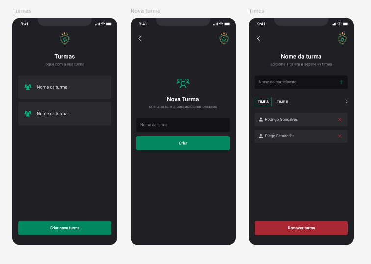

## 📱 Ignite Teams

Projeto desenvolvido no segundo modulo do curso de React Native da [@Rocketseat](https://www.rocketseat.com.br/) 💜🚀. Onde foi desenvolvido um aplicativo com intuito de ajudar a organizar pessoas que se reunem em turmas para jogar.

### ⚙️ Tecnologias

* [React Native](https://reactnative.dev/)
* [Expo](https://expo.dev/)
* [Typescript](https://www.typescriptlang.org/)
* [styled-components](https://styled-components.com/)
* [Phosphor Icons](https://phosphoricons.com/)
* [Async Storage](https://github.com/react-native-async-storage/async-storage)
* [Native Stack Navigator](https://reactnavigation.org/docs/native-stack-navigator/)

### ✅ Features

-   [X]  Criar turma
-   [X]  Listar turmas
-   [X]  Adiconar participante a uma turma
-   [X]  Adiconar participante a um time
-   [X]  Listar participantes filtrando por time
-   [X]  Remover participante
-   [X]  Remover turma

### 📝 Licença

Esse projeto está sob a licença MIT. Veja o arquivo [LICENSE](LICENSE) para mais detalhes.

---